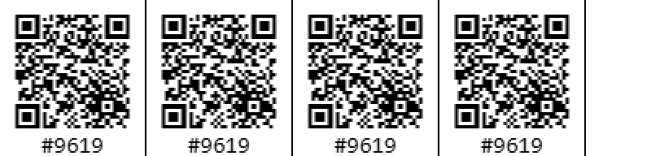
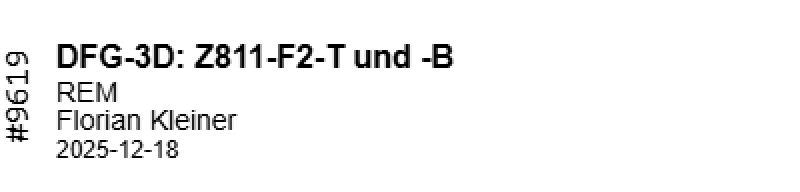

<p align="center">
  
</p>

# eLabFTW Label Printer (NIIMBOT) – Chrome Extension

Chrome extension that allows you to print labels with a QR code directly from eLabFTW.

Currently, there are three presets for 14 × 50 mm labels.

## Prerequisites

1. [Chrome browser](https://www.google.com/chrome/)
2. [Node.js](https://nodejs.org/en/download)
3. A NIIMBOT printer (tested with NIIMBOT N1)

## Build

```bash
cd elabftw-labelprinter
npm install
npm run build
```

Note: `npm run build` auto-increments the patch `version` in `elabftw-labelprinter/manifest.json`.

## Import into Chrome

1. Open `chrome://extensions`
2. Enable **Developer mode**
3. Click **Load unpacked** and select the `elabftw-labelprinter/` folder (the one containing `manifest.json`)
4. After rebuilding, click **Reload** on the extension

## Dev (watch)

```bash
cd elabftw-labelprinter
npm run watch
```

## Usage

1. Open your experiment in eLabFTW.
2. Click on the extension icon in the Chrome toolbar.<br />
   
3. A new pop-up will appear in which you can choose a preset.
4. On the first extension start, or after clicking **Connect**, you can choose the Niimbot printer (remember to turn it on beforehand).
5. Click **Print** and wait a few seconds until the label is printed.
6. For a short video demonstration, see [`media/how-to-use.mp4`](./media/how-to-use.mp4).

## Available Presets
For Label size 14 × 50 mm labels. While you can select other label sizes, the presets are not optimised for them.

### QR + Text


QR code left, with title, category, owner and date.

### QR only



Large centered QR code.

### Text only



Title, category, owner and date


## Authors
- [Frowin Ellermann](https://frowinellermann.com)
- [Florian Kleiner](https://floriankleiner.de)

## Acknowledgements
- [eLabFTW](https://www.elabftw.net) – open-source electronic lab notebook this extension integrates with
- [@mmote/niimbluelib](https://github.com/MultiMote/niimbluelib) – Niimbot BLE communication library
